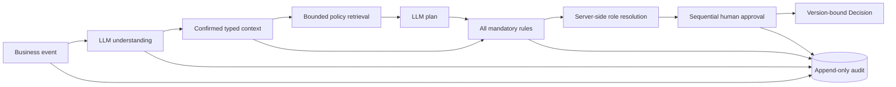

# Architecture

Flowless separates probabilistic understanding from the permission boundary.

The React UI and external callers use the same Fastify API. The API and in-process analysis worker share PostgreSQL. A persisted job lease allows recovery after process failure without introducing Redis; claim tokens and request revisions fence off late model responses.

Policy retrieval limits model context. It never defines the safety boundary: all published mandatory rules whose applicability is true or unknown are evaluated independently with three-valued logic. Missing facts, ambiguous assignees, self-approval, stale policy or organization versions, and invalid model output block submission.

Approval action, next-step activation, final decision, and audit insertion share one database transaction. Database triggers prevent updates or deletion of both published Policy versions and audit events, including accidental writes made outside the HTTP API.

See [ADR 0001](adr-0001-safety-boundary.md) for the governing decision.
